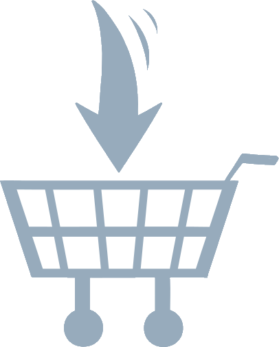

#  Unified Shopping List
The Unified Shopping List is an open source app to connect your shopping lists in real time. The goal of the USL is to make managing your grocery shopping *easy* and *configurable*.
This project was born out of a frustration with existing integration tools, for both being a pain (or impossible) to set up, unreliable, and/or having little-to-no configurability.

The USL relies heavily on [Mealie](https://github.com/hay-kot/mealie), the open source, self-hosted recipe manager developed by hay-kot. This app *does not work* without an instance of Mealie to back it up, so [be sure to check it out](https://nightly.mealie.io/) if you haven't already! The app piggybacks heavily on the Mealie API, and much of the dev environment was pulled directly from the work done over there. ***We only officially support the v1 releases of Mealie, as well as the latest release***.

To get started, head over to https://shopping-lists.genson.dev and register.

Architecture
---
The Unified Shopping List backend is built using [FastAPI](https://fastapi.tiangolo.com/) and hosted in AWS using a combination of [API Gateway](https://aws.amazon.com/api-gateway/) and [Lambda](https://aws.amazon.com/lambda/). We use [DynamoDB](https://aws.amazon.com/dynamodb/) for user storage and [SQS](https://aws.amazon.com/sqs/) for managing webhooks.

The frontend is served by FastAPI rendering [Jinja2](https://jinja.palletsprojects.com/en/3.1.x/) templates + [Bootstrap](https://getbootstrap.com/), rather than a more robust framework like Angular or Vue. This keeps things ultra-simple (and the frontend is really only for configuration anyway).

Why host a centralized app? Why not build a self-hosted solution / build this functionality into Mealie?
---
I am a huge supporter of self-hosted applications; this app is built entirely around Mealie, which itself is a self-hosted app. It's hard to consider data that you have "somewhere else" truly yours.

That said, one of the major roadblocks with integrations comes down to the exposed APIs and authentication schemes. The goal of this app at its inception was to integrate Mealie with [Todoist](https://todoist.com/) and [Amazon's Alexa](https://alexa.amazon.com/). Sadly, [Amazon is removing all support for integrating with Alexa lists](https://developer.amazon.com/en-US/docs/alexa/custom-skills/access-the-alexa-shopping-and-to-do-lists.html). However, while this was still supported, any and all Alexa integrations require an Alexa skill, which connects via OAuth, which requires a central authentication server. If you wanted to do this yourself, you would need to [build and host your own Alexa skill](https://github.com/michael-genson/Unified-Shopping-List-Helper).

While Todoist has a [REST API](https://developer.todoist.com/rest/v2/#overview), their webhook subscriptions (which this app uses to initiate a sync) [require an app using OAuth](https://developer.todoist.com/sync/v9/#webhooks), which (you guessed it) requires a central authentication server. You *can* get it working without one, but it's not particularly easy if you're not experienced with OAuth.

Which applications are supported?
---
Since we are *just* releasing the Unified Shopping List, we don't support too many applications yet. Feel free to explore GitHub discussions and suggest new apps to support.

Supported applications:
- [Mealie](https://github.com/hay-kot/mealie/) (required, only the *official v1 releases* and *latest release* are supported)
- [Todoist](https://todoist.com/)
- ~~Alexa *[no longer supported by Amazon](https://developer.amazon.com/en-US/docs/alexa/custom-skills/access-the-alexa-shopping-and-to-do-lists.html)*~~

(Soft) Roadmap
---
Features
- add support for more applications
- explore weekly item scheduling
- expand API for end-user custom integrations

Quality of Life
- improve mobile frontend experience

Development / DevOps
- remove SAM from dev container
- implement github actions
    - deployments
    - versioning
